# PYNQ-Z2 图像核上板验算报告

**2026-10-08 · 640 × 480 · BGR L1 阈值分割 + 3×3 开运算**

**475 次 CPU / FPGA 逐像素对比全部通过，差异像素为 0，约 1.5 倍加速。**

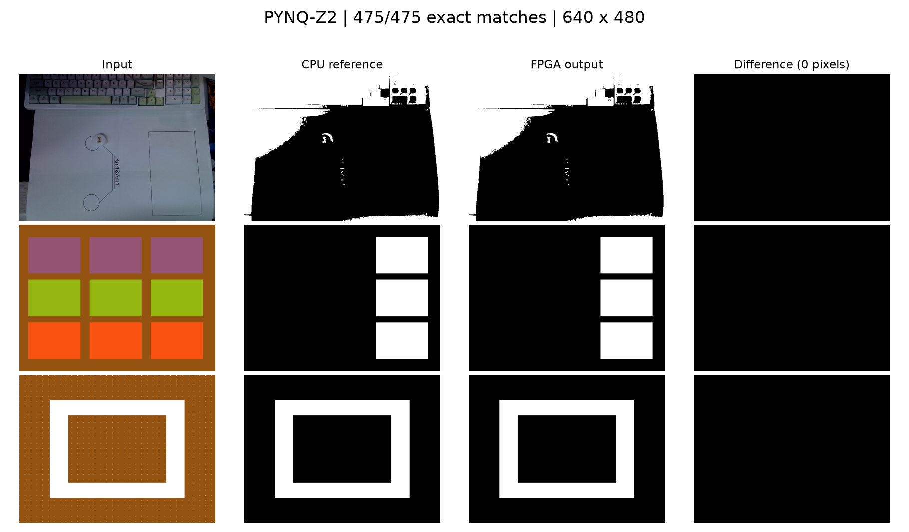

## 实测结果

| 测试组 | 对比次数 | CPU平均 ms | FPGA平均 ms | 加速比 |
|---|---:|---:|---:|---:|
| 原参数照片 | 200 | 159.42 | 107.26 | 1.486× |
| 边界、阈值及噪点 | 60 | 158.29 | 105.62 | 1.499× |
| 测试背景参数照片 | 200 | 157.97 | 105.49 | 1.497× |
| 本次相机新画面 | 15 | 161.06 | 107.89 | 1.493× |

FPGA耗时包含图像打包、DMA传输、等待及结果拷贝；保存图片不计入算法耗时。运行前预热，CPU和FPGA计时顺序交替。加速比针对现有 NumPy/OpenCV CPU 参考实现，不代表整机识别或抓取帧率。

## 验证内容与限制

- 配对位流与描述文件已上传、校验并在 PYNQ-Z2 实际加载。
- 四组共475次比较通过；35对首轮输出下载后再次核验，CPU与FPGA掩膜相同，差异图全黑。
- 专项测试覆盖空背景、全前景、图像四边、细线、孔洞、随机噪点、不对称BGR背景及阈值99/100/101。
- 默认背景 `[240,240,240]` 会使现有照片几乎全部成为前景，因此补充专项图案及测试背景 `[145,140,136]` 下的照片。测试参数不能代替最终工位的背景、ROI和坐标标定。
- 本轮未验收YOLO分类准确率、编码器计数或物理分拣成功，未执行机械动作。
- 板卡时钟未校准，原始图片文件名中的时间不代表本次实验日期；报告日期采用电脑日期，耗时采用单调计时器。

## 数据与网页版本

- [完整数据 summary.json](summary.json)
- [网页入口 index.html](index.html)：下载本目录后打开，可展开全部对比图。
- 下方为GitHub直接可读的完整图文版，图片可点击放大。

## 全部图像证据

### 原参数照片

**00_1746293899356483904_r00**

| 输入 | CPU参考 | FPGA输出 | 差异（黑色为一致） |
|---|---|---|---|
|  |  |  |  |

**01_1746293904858634512_r00**

| 输入 | CPU参考 | FPGA输出 | 差异（黑色为一致） |
|---|---|---|---|
| 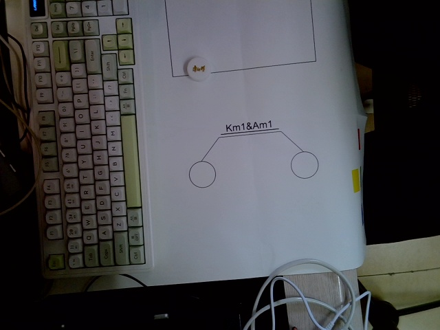 |  |  |  |

**02_1746293909928601138_r00**

| 输入 | CPU参考 | FPGA输出 | 差异（黑色为一致） |
|---|---|---|---|
| 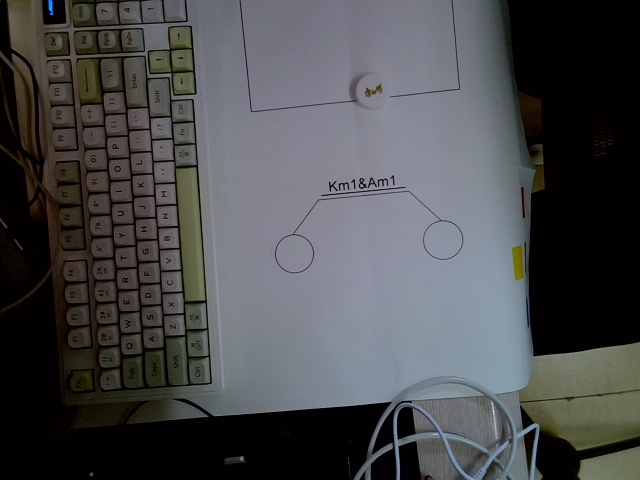 |  |  |  |

**03_1746293914998606195_r00**

| 输入 | CPU参考 | FPGA输出 | 差异（黑色为一致） |
|---|---|---|---|
|  |  |  |  |

**04_1746294407406283283_r00**

| 输入 | CPU参考 | FPGA输出 | 差异（黑色为一致） |
|---|---|---|---|
| 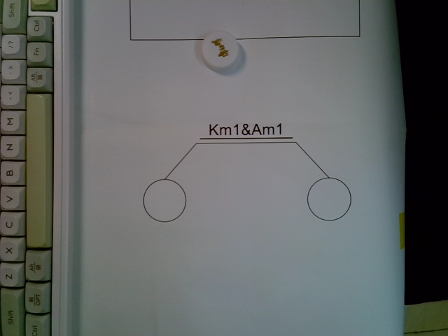 |  |  |  |

**05_1746295623221693902_r00**

| 输入 | CPU参考 | FPGA输出 | 差异（黑色为一致） |
|---|---|---|---|
|  |  |  |  |

**06_1746295628291712534_r00**

| 输入 | CPU参考 | FPGA输出 | 差异（黑色为一致） |
|---|---|---|---|
| 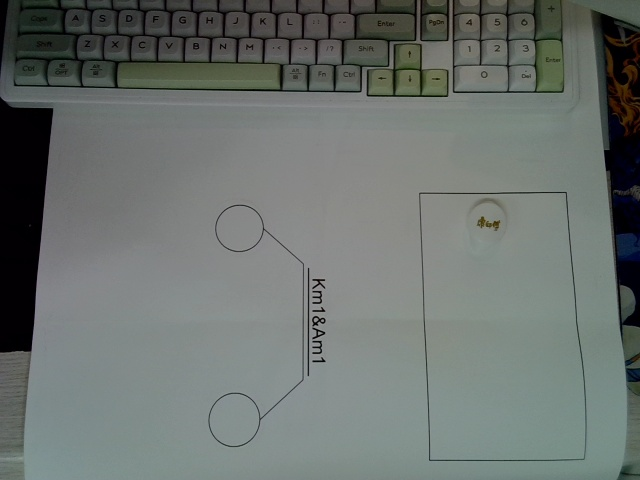 |  |  |  |

**07_1746295633361909001_r00**

| 输入 | CPU参考 | FPGA输出 | 差异（黑色为一致） |
|---|---|---|---|
| 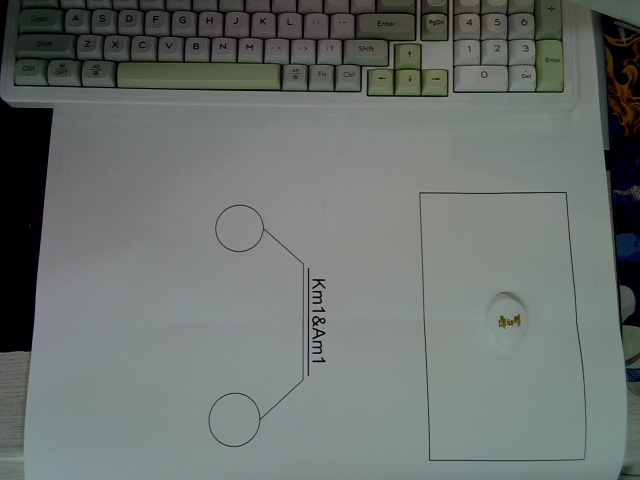 |  |  |  |

**08_1746295638467873122_r00**

| 输入 | CPU参考 | FPGA输出 | 差异（黑色为一致） |
|---|---|---|---|
|  |  |  |  |

**09_1746295643567956111_r00**

| 输入 | CPU参考 | FPGA输出 | 差异（黑色为一致） |
|---|---|---|---|
| 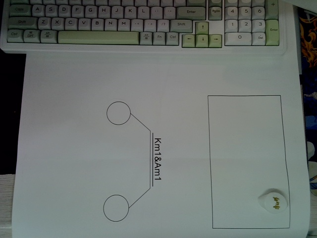 |  |  |  |

### 边界、阈值及噪点

**00_00_background_r00**

| 输入 | CPU参考 | FPGA输出 | 差异（黑色为一致） |
|---|---|---|---|
|  |  |  |  |

**01_01_foreground_r00**

| 输入 | CPU参考 | FPGA输出 | 差异（黑色为一致） |
|---|---|---|---|
|  |  |  |  |

**02_02_edges_and_blocks_r00**

| 输入 | CPU参考 | FPGA输出 | 差异（黑色为一致） |
|---|---|---|---|
|  |  | 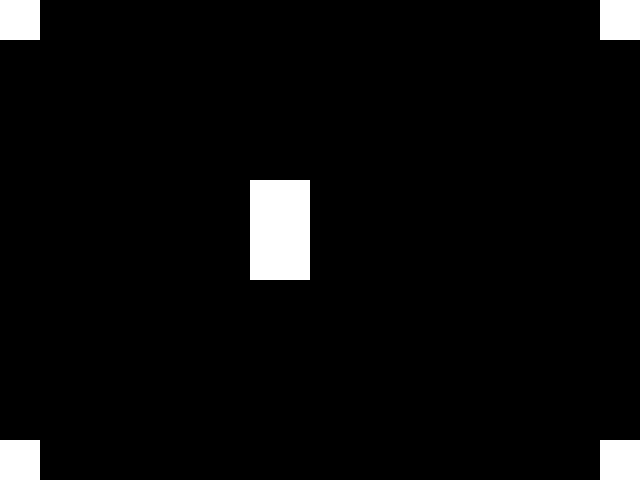 |  |

**03_03_isolated_noise_r00**

| 输入 | CPU参考 | FPGA输出 | 差异（黑色为一致） |
|---|---|---|---|
|  |  |  |  |

**04_04_thin_stripes_r00**

| 输入 | CPU参考 | FPGA输出 | 差异（黑色为一致） |
|---|---|---|---|
| 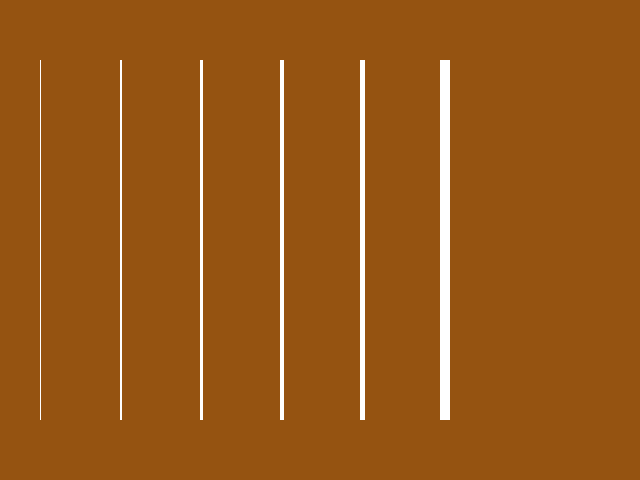 | 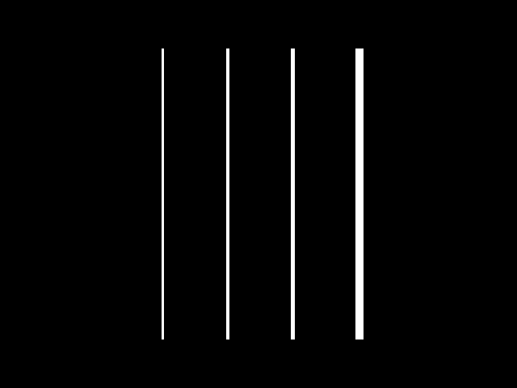 |  |  |

**05_05_threshold_and_channels_r00**

| 输入 | CPU参考 | FPGA输出 | 差异（黑色为一致） |
|---|---|---|---|
|  |  | 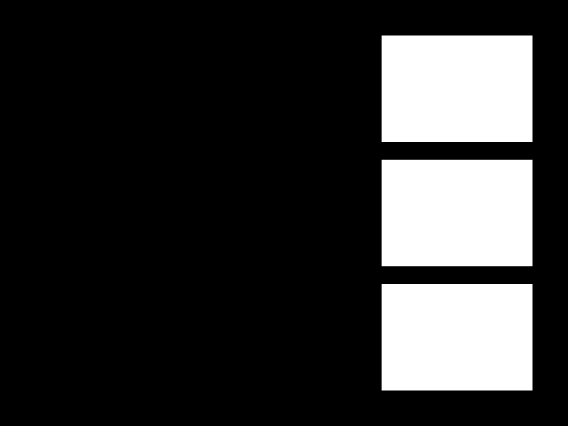 |  |

**06_06_holes_and_noise_r00**

| 输入 | CPU参考 | FPGA输出 | 差异（黑色为一致） |
|---|---|---|---|
| 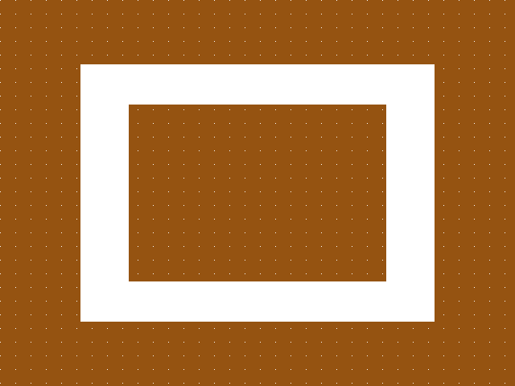 |  |  |  |

**07_07_random_rgb_r00**

| 输入 | CPU参考 | FPGA输出 | 差异（黑色为一致） |
|---|---|---|---|
| 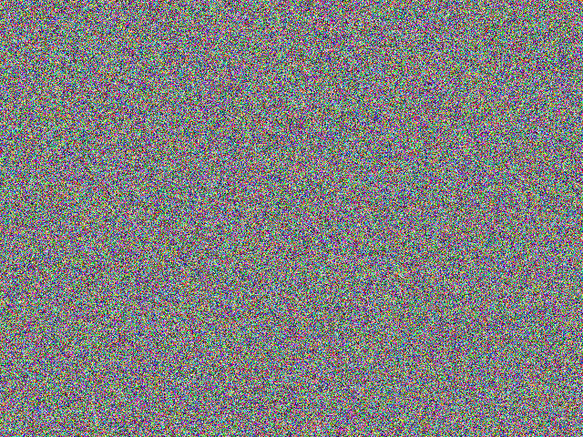 | 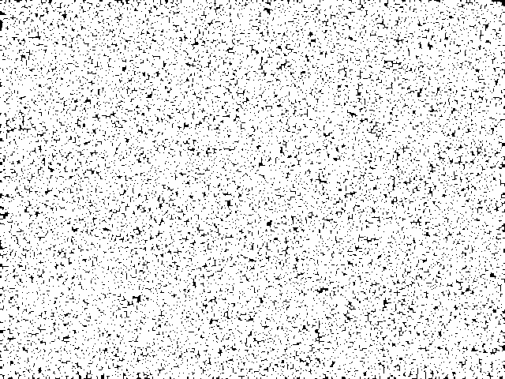 |  |  |

**08_08_checkerboard_r00**

| 输入 | CPU参考 | FPGA输出 | 差异（黑色为一致） |
|---|---|---|---|
|  |  |  |  |

**09_09_dense_random_mask_r00**

| 输入 | CPU参考 | FPGA输出 | 差异（黑色为一致） |
|---|---|---|---|
| 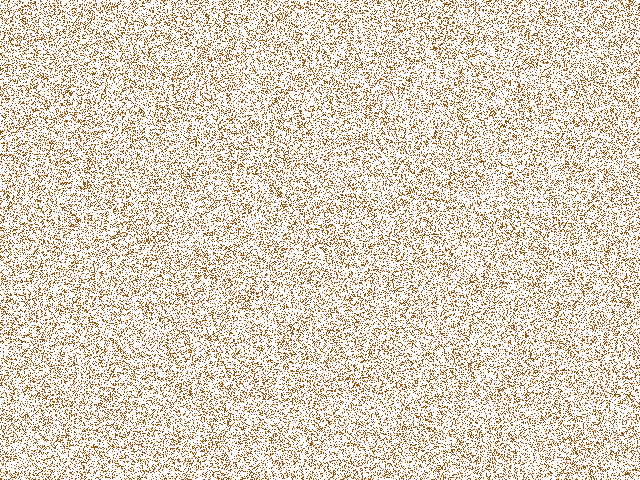 | 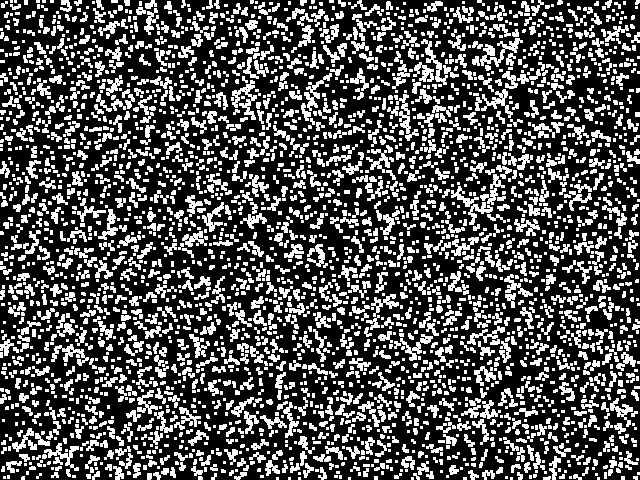 |  |  |

**10_10_last_rows_columns_r00**

| 输入 | CPU参考 | FPGA输出 | 差异（黑色为一致） |
|---|---|---|---|
|  |  |  |  |

**11_11_first_rows_columns_r00**

| 输入 | CPU参考 | FPGA输出 | 差异（黑色为一致） |
|---|---|---|---|
|  |  |  |  |

### 测试背景参数照片

**00_1746293899356483904_r00**

| 输入 | CPU参考 | FPGA输出 | 差异（黑色为一致） |
|---|---|---|---|
| 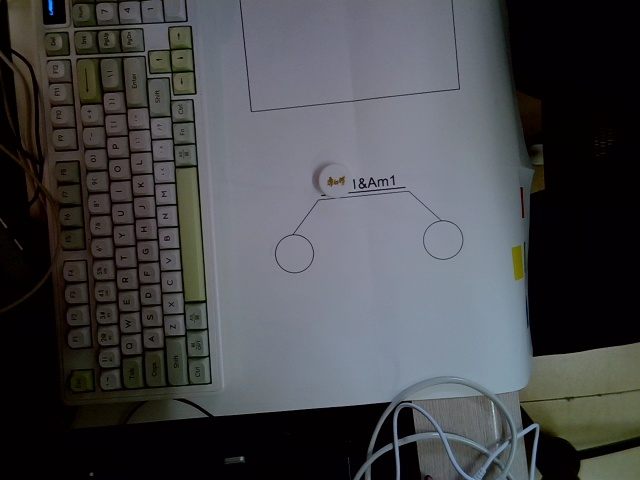 | 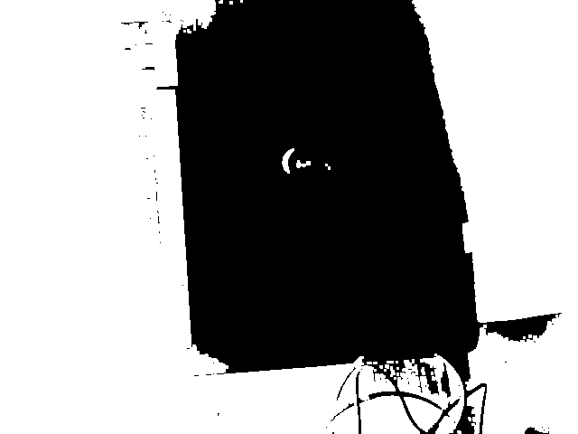 |  |  |

**01_1746293904858634512_r00**

| 输入 | CPU参考 | FPGA输出 | 差异（黑色为一致） |
|---|---|---|---|
|  | 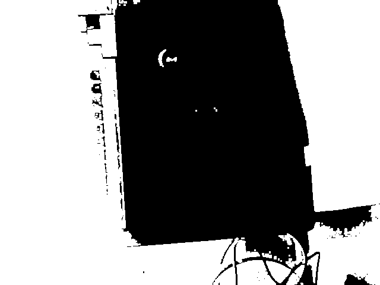 |  |  |

**02_1746293909928601138_r00**

| 输入 | CPU参考 | FPGA输出 | 差异（黑色为一致） |
|---|---|---|---|
|  |  | 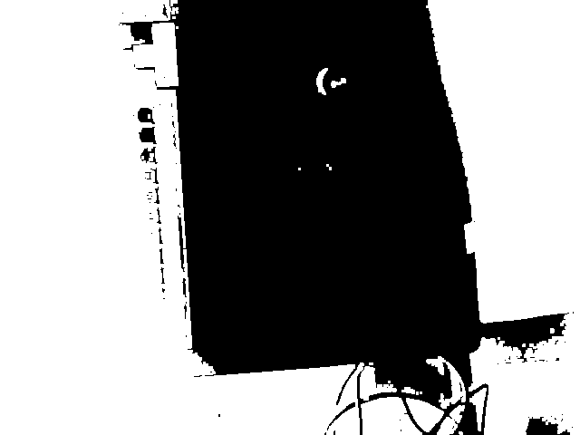 |  |

**03_1746293914998606195_r00**

| 输入 | CPU参考 | FPGA输出 | 差异（黑色为一致） |
|---|---|---|---|
| 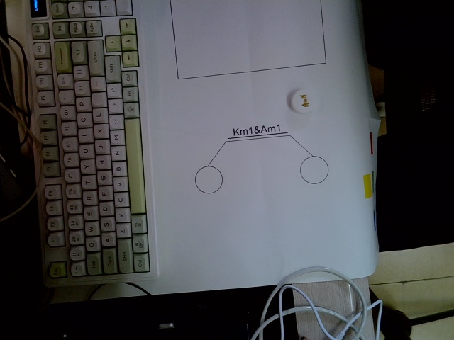 |  | 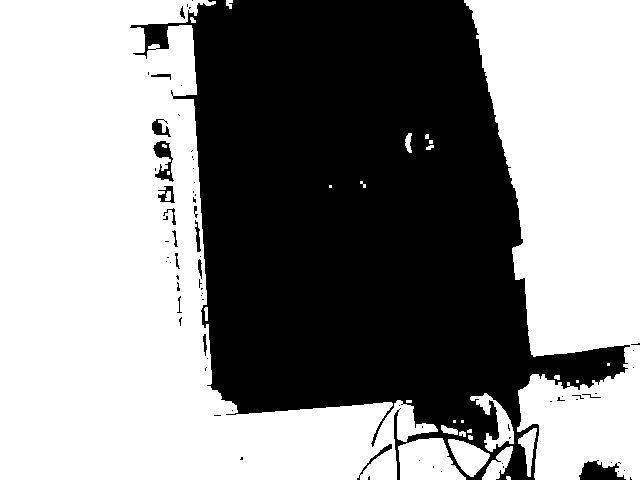 |  |

**04_1746294407406283283_r00**

| 输入 | CPU参考 | FPGA输出 | 差异（黑色为一致） |
|---|---|---|---|
|  | 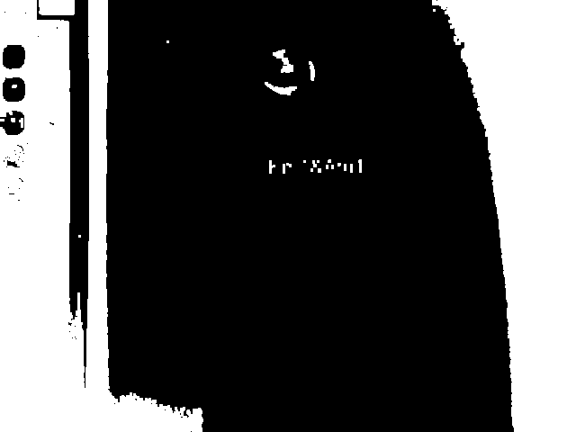 |  |  |

**05_1746295623221693902_r00**

| 输入 | CPU参考 | FPGA输出 | 差异（黑色为一致） |
|---|---|---|---|
| 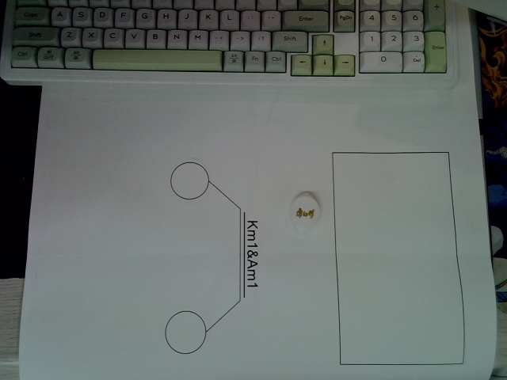 |  | 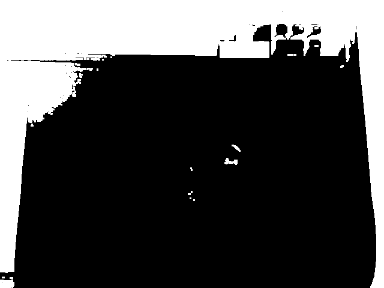 |  |

**06_1746295628291712534_r00**

| 输入 | CPU参考 | FPGA输出 | 差异（黑色为一致） |
|---|---|---|---|
|  | 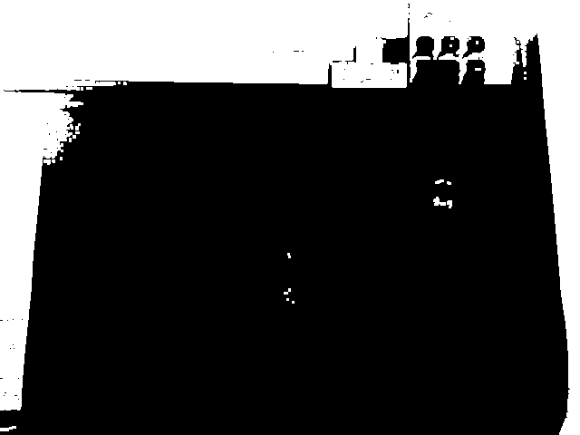 |  |  |

**07_1746295633361909001_r00**

| 输入 | CPU参考 | FPGA输出 | 差异（黑色为一致） |
|---|---|---|---|
|  |  | 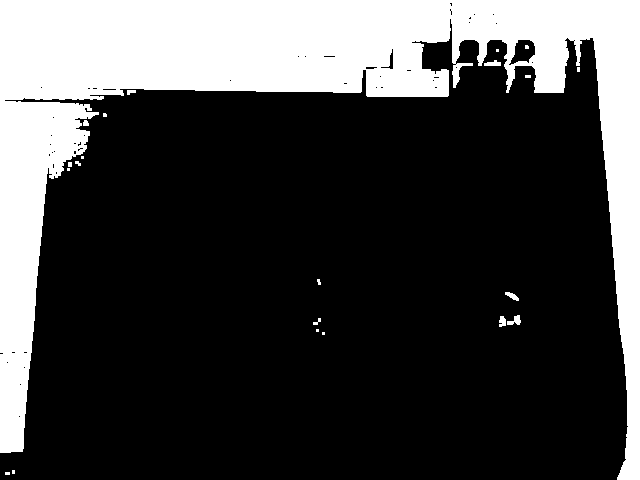 |  |

**08_1746295638467873122_r00**

| 输入 | CPU参考 | FPGA输出 | 差异（黑色为一致） |
|---|---|---|---|
| 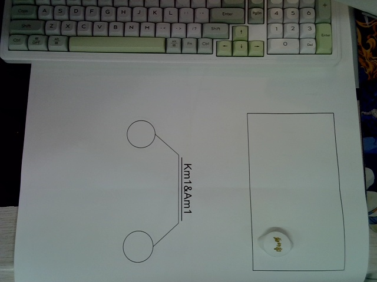 |  | 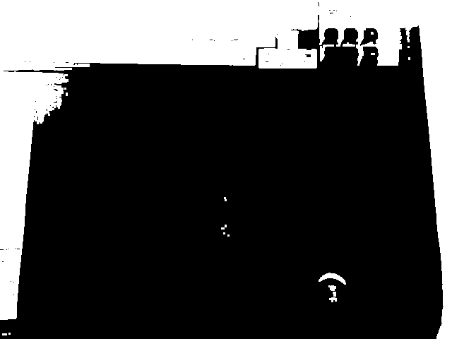 |  |

**09_1746295643567956111_r00**

| 输入 | CPU参考 | FPGA输出 | 差异（黑色为一致） |
|---|---|---|---|
|  |  | 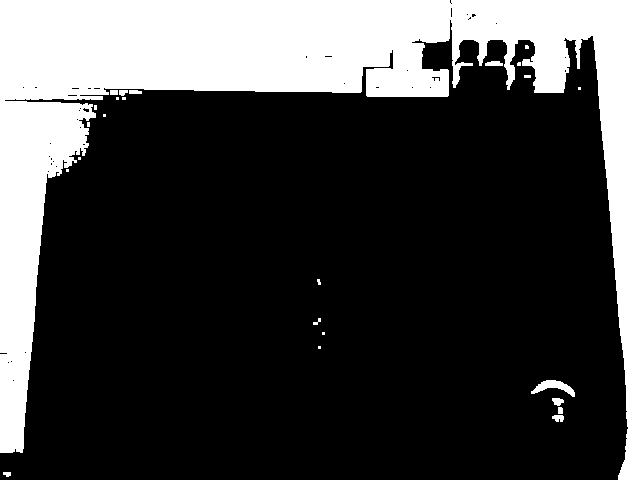 |  |

### 本次相机新画面

**00_1746296782814562381_r00**

| 输入 | CPU参考 | FPGA输出 | 差异（黑色为一致） |
|---|---|---|---|
| 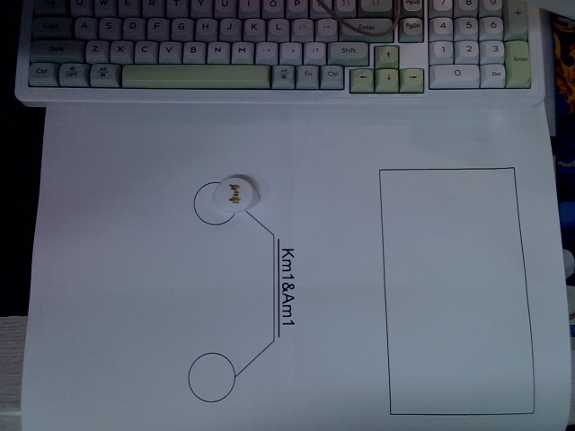 | 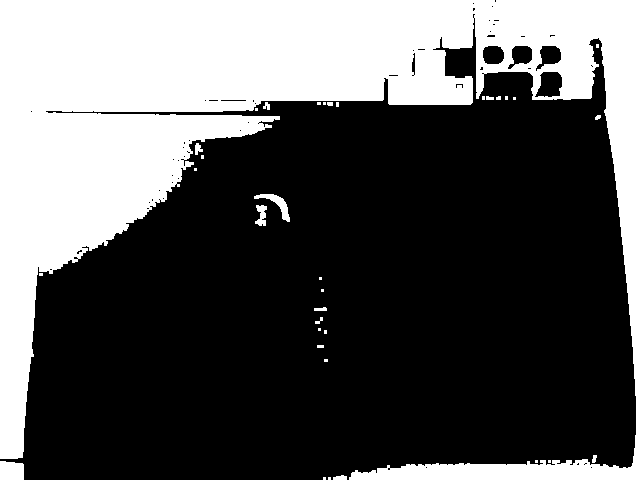 |  |  |

**01_1746296783414640700_r00**

| 输入 | CPU参考 | FPGA输出 | 差异（黑色为一致） |
|---|---|---|---|
| 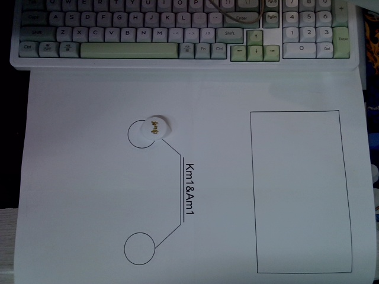 |  | 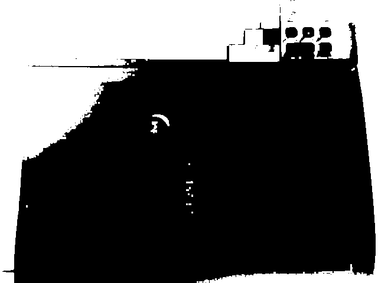 |  |

**02_1746296783978520724_r00**

| 输入 | CPU参考 | FPGA输出 | 差异（黑色为一致） |
|---|---|---|---|
| 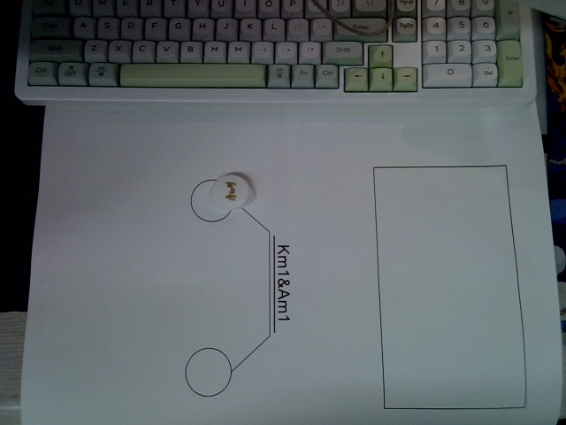 | 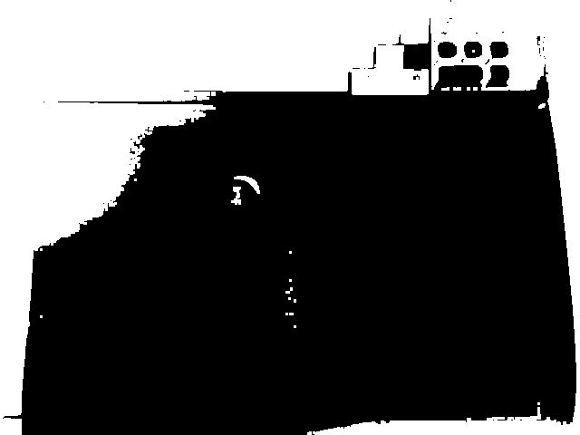 |  |  |

## 构建产物追溯

- `vision.bit` SHA-256：`f65a1d973cdd1d17303775f9277831ba69eb4151af86451185ab920ee45686ef`
- `vision.hwh` SHA-256：`8a78ac52de95d50f0070439e77ad72113ab458db57e3dbae4e00642e41422908`

分享目录仅包含实验报告、输出图像及结果数据；设备运行配置未包含在内。
